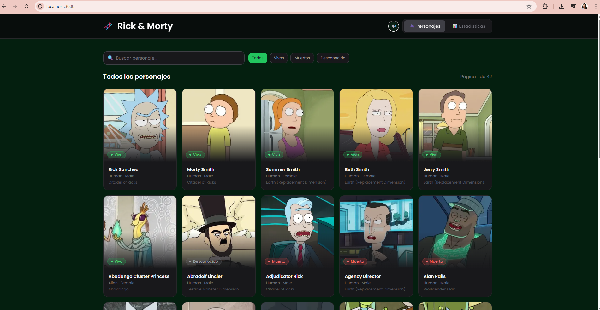
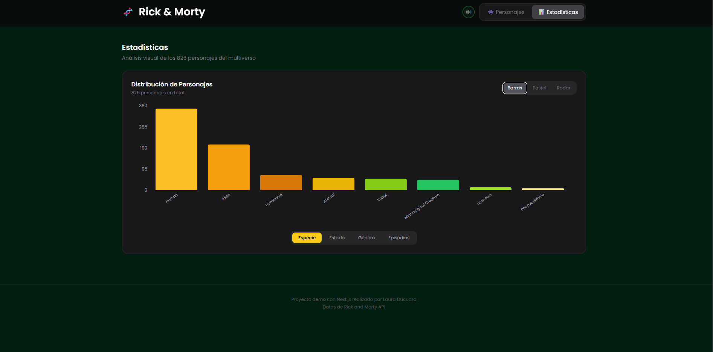
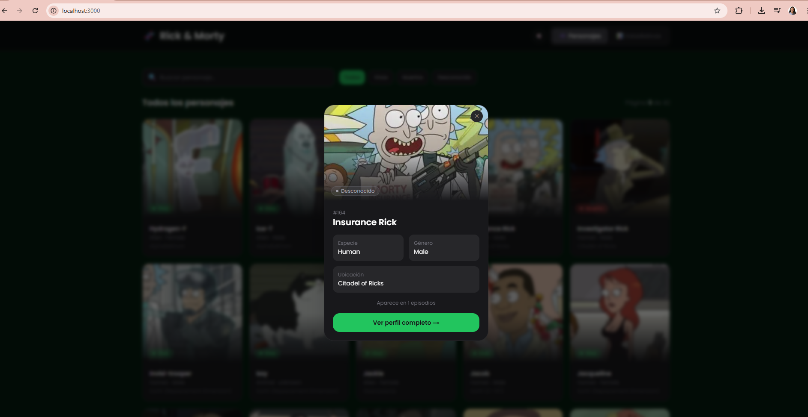
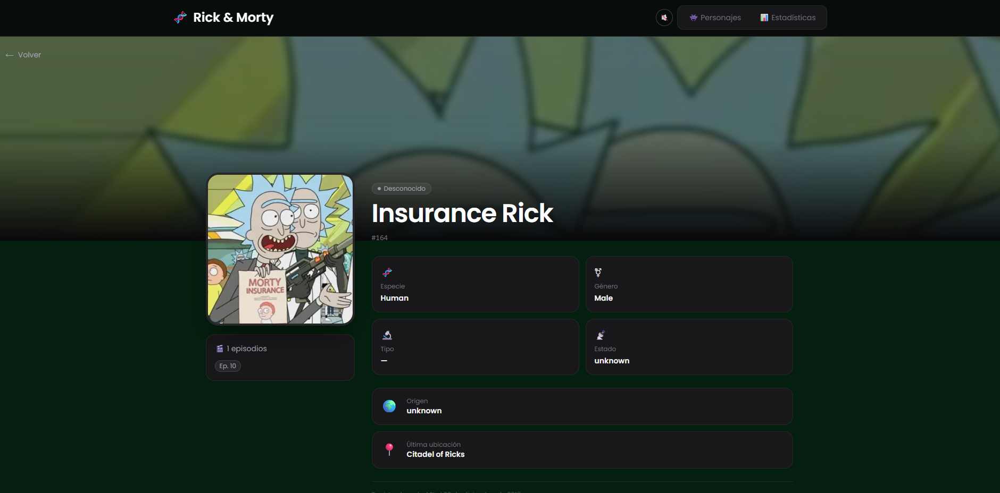
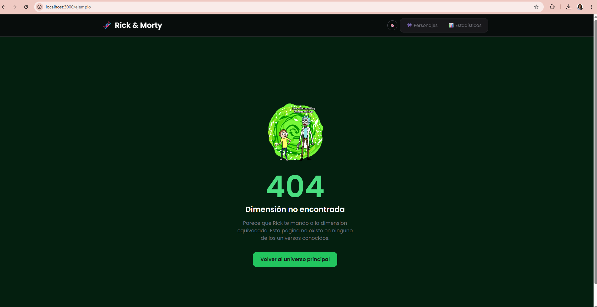

# Rick & Morty Explorer 🧬

Aplicación para explorar los personajes del universo de Rick and Morty, 
hecha como prueba técnica. Construida con Next.js 14 y TypeScript.

🔗 **Demo:** [rick-and-morty-app-react-ts-pu7w.vercel.app](https://rick-and-morty-app-react-ts-pu7w.vercel.app)

---

## De que trata

Consume la API de rickandmortyapi.com para mostrar los personajes de la serie.
Tiene dos secciones: una para explorar personajes con filtros, y otra con graficas
para analizar los datos.

Funcionalidades principales:
- Cards de personajes con imagen, nombre, estado y ubicacion
- Filtro por nombre y por estado (vivo, muerto, desconocido)
- Paginacion con selector de pagina directo
- Modal con info basica del personaje y boton para ver mas detalles
- Pagina de detalle por personaje
- Graficas por especie, estado, genero y episodios (barras, pastel y radar)
- Pagina 404 y pagina de error personalizadas
- Musica de intro opcional en el navbar (detalle extra)

---

## Como correrlo

Necesitas Node.js 20+

```bash
git clone https://github.com/lauraducuara/rick-and-morty-app-react-ts.git
cd rick-and-morty-app-react-ts
npm install
npm run dev
```

Abrir http://localhost:3000

Crear un `.env` en la raiz del proyecto:
NEXT_PUBLIC_API_URL=https://rickandmortyapi.com/api

---

## Capturas

### Inicio


### Estadisticas


### Modal


### Detalle personaje



### Página 404

---

## Estructura
├── app/                          # rutas de la app
│   ├── page.tsx
│   ├── layout.tsx
│   ├── error.tsx
│   ├── not-found.tsx
│   └── character/[id]/page.tsx
├── components/
│   ├── ui/                      # componentes genericos
│   ├── characters/              # todo acerca de personajes
│   └── charts/                  # graficas
├── hooks/                       # tanstack query
├── services/                    # fetch a la API
├── store/                       # zustand
├── types/                       # zod + typescript
└── utils/                       # helpers para las graficas

---

## Stack

- Next.js 14 + TypeScript
- Tailwind CSS
- TanStack Query
- Zustand
- Zod
- Recharts

---

Hecho por [Laura Ducuara](https://www.linkedin.com/in/laura-alejandra-ducuara-covos-6b2650208/)